# Using Flux, a GitOps Tool, with Amazon Elastic Kubernetes Service (EKS)

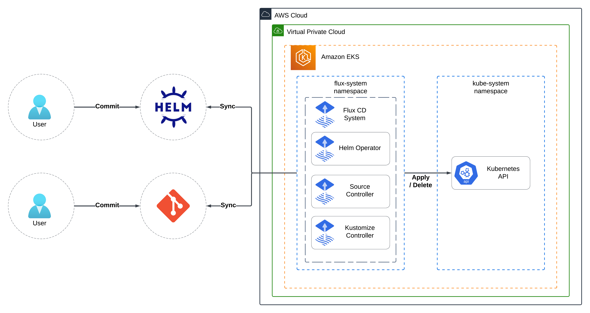

## Table of Contents

1. [Introduction](#introduction)
2. [What is GitOps?](#what-is-gitops)
3. [Flux, a GitOps Tool](#flux-a-gitops-tool)
4. [Architecture Overview](#architecture-overview)
5. [Prerequisites](#prerequisites)
6. [Setup and Deploy Infrastructure](#setup-and-deploy-infrastructure)
7. [Configure access to Amazon EKS Cluster](#configure-access-to-amazon-eks-cluster)
8. [Create and Push Docker Image to Amazon ECR](#create-and-push-docker-image-to-amazon-ecr)
   1. [Build the Docker Image](#build-the-docker-image)
   2. [Push the Docker Image to Amazon ECR](#push-the-docker-image-to-amazon-ecr)
9. [Install Flux CLI and Weave GitOps CLI](#install-flux-cli-and-weave-gitops-cli)
10. [Configure and Install Flux](#configure-and-install-flux)
11. [Folder Structure of Flux Git Repository](#folder-structure-of-flux-git-repository)
12. [Managing Flux](#managing-flux)
13. [Weave GitOps - A Flux Web User Interface](#weave-gitops---a-flux-web-user-interface)
14. [Kubernetes Addons managed by Flux](#kubernetes-addons-managed-by-flux)
15. [Applications managed by Flux](#applications-managed-by-flux)
16. [Access Applications managed by Flux](#access-applications-managed-by-flux)
17. [Demonstrate how Flux works](#demonstrate-how-flux-works)
    1. [Check the Status of Flux](#check-the-status-of-flux)
    2. [Reconcile Helm Release with Flux](#reconcile-helm-release-with-flux)
18. [Clean Up](#clean-up)
    1. [Clean up Applications managed by Flux from Kubernetes](#clean-up-applications-managed-by-flux-from-kubernetes)
    2. [Clean up Kubernetes AddOns managed by Flux from Kubernetes](#clean-up-kubernetes-addons-managed-by-flux-from-kubernetes)
    3. [Uninstall Flux from Kubernetes](#uninstall-flux-from-kubernetes)
    4. [Clean up Terraform](#clean-up-terraform)
19. [Conclusion](#conclusion)

## Introduction

Have you ever wondered if there was a better way to manage the lifecycle of an application, from deploying the application, scaling the application, and managing the required infrastructure while storing the code in Git and allowing versioning of the code? Well, there is a way. It is called GitOps.

This guide will explain what GitOps is and show you how to use Flux, a GitOps tool, with Amazon Elastic Kubernetes Service (EKS). You will use Flux to deploy various Kubernetes Services and Applications to Amazon Elastic Kubernetes Service (EKS). In addition, you will create a container image containing the code for the React container. You will upload the container image to a private Amazon Elastic Container Registry.

You can access all of the code used in my [GitHub Repository](https://github.com/junglekid/aws-eks-fluxcd-lab).

Before we begin, let's define what GitOps is and what GitOps tool we will use in this guide.

## What is GitOps?

GitOps is a software development and operations (DevOps) methodology that leverages the principles of version control and collaboration from Git to manage the deployment and operation of applications and infrastructure more efficiently. The core idea behind GitOps is to use Git repositories as the source of truth for both application code and infrastructure configuration. This approach aims to streamline and automate deploying, managing, and monitoring software systems.

GitOps works on a few foundational principles:

1. **Declarative Infrastructure**: In a GitOps workflow, all aspects of your application's infrastructure, including configuration files, deployment manifests, and environment settings, are stored as code in a Git repository. This means that the desired state of your application's infrastructure is defined declaratively in these code files.

2. **Version-Controlled System**: All the declarative representations of the desired system state are stored in a Git repository. This includes application code, configuration, deployment manifests, and more.

3. **Continuous Deployment**: Any infrastructure or application code changes are made by committing and pushing changes to the Git repository. The Git repository serves as a single source of truth for both the development and operations teams. This is known as "continuous deployment" or "continuous delivery," as changes are automatically propagated through the pipeline once pushed to the repository.

4. **Automated Convergence:** Continuous integration and continuous deployment (CI/CD) tools automatically converge the actual system state towards the desired state represented in the Git repository. If someone changes the configuration in Git, CI/CD tools apply those changes to the environment.

5. **Pull-Based Deployments**: Rather than pushing changes out to environments, the environments (via agents or operators) pull the desired state from the Git repository and enact any necessary changes.

Benefits of GitOps:

1. **Versioning and Auditability**: Since everything is in Git, you have an audit trail of who changed what and when. It becomes easy to roll back to a previous desired state if necessary.

2. **Enhanced Developer Productivity**: Developers are already familiar with Git. Using Git as the deployment mechanism, developers can use the same infrastructure and source code workflows.

3. **Consistency and Reliability**: By defining and storing configurations declaratively and applying them automatically, it's possible to ensure consistent environments.

4. **Faster Recovery**: If something goes wrong in production, the correct desired state is in the Git repository. Systems can quickly revert to a previous, known-good state, or problematic changes can be quickly identified and corrected.

5. **Improved Collaboration**: Since everything is stored in Git, teams can collaborate using merge requests, reviews, and discussions around the code.

Popular tools and platforms implementing the GitOps methodology include Flux, ArgoCD, Jenkins X, and Weaveworks' FluxCD. These tools provide automation and integration capabilities to help facilitate the GitOps workflow.

GitOps is a powerful approach for improving software deployment and operations' reliability, traceability, and efficiency by integrating version control practices with DevOps principles.

The GitOps model particularly shines in Kubernetes environments due to Kubernetes' declarative nature, but it's not limited to it. However, like any other methodology, GitOps is not a silver bullet and might only be viable for some scenarios or organizations. Proper tooling, understanding, and training are essential to reaping the full benefits of GitOps.

## Flux, a GitOps Tool

**Flux**, sometimes called Flux CD, is an open-source tool for automating applications and infrastructure deployment and lifecycle management in Kubernetes clusters. It's part of the broader ecosystem of tools that facilitate continuous delivery and GitOps practices in Kubernetes environments.

The core idea behind Flux is to maintain a declarative representation of the desired state of your Kubernetes resources in a Git repository. This GitOps approach ensures that any changes to the infrastructure or application configurations are made through code changes in the Git repository, which triggers Flux to synchronize and apply those changes to the Kubernetes cluster.

Critical features of Flux include:

1. **Automated Synchronization**: Flux monitors the Git repository for changes and automatically synchronizes the cluster with the desired state defined in the repository.

2. **Multi-Environment Support**: Flux CD supports managing multiple environments (e.g., development, staging, production) with different configurations and policies.

3. **Versioning**: The Git repository serves as a versioned history of your infrastructure and application changes, allowing you to track changes over time and roll back if needed.

4. **Release Automation**: Flux can be integrated with CI/CD pipelines to automate the release process, triggering deployments when new code is merged to specific branches.

5. **Policy Enforcement**: Flux supports applying policies and rules to ensure that only approved changes are applied to the cluster, enhancing security and compliance.

6. **Integrations**: It can be used alongside other tools, like Helm, Kubernetes Operators, and more, to manage a wide variety of resources in your cluster.

Flux promotes the GitOps approach, which emphasizes using version-controlled Git repositories as the single source of truth for your application and infrastructure configurations. This approach enhances collaboration, transparency, and traceability while reducing the risk of manual errors and ensuring consistent deployments. Additional information on Flux can be found [here](https://fluxcd.io/).

## Architecture Overview

* HashiCorp Terraform
* Flux
* GitHub
* Amazon Elastic Kubernetes Service (EKS)
* Amazon Elastic Container Registry (ECR)
* AWS Key Management Service (KMS)
* Amazon Route 53
* AWS Certificate Manager (ACM)
* Amazon Virtual Private Cloud (Amazon VPC)
* IAM policies and roles

## Prerequisites

Before you begin, make sure you have the following before starting:

1. An active AWS account. You can create a new [AWS account here](https://repost.aws/knowledge-center/create-and-activate-aws-account).
2. AWS CLI installed and configured. Instructions can be found [here](https://aws.amazon.com/cli/).
3. Terraform installed. Instructions can be found [here](https://developer.hashicorp.com/terraform/tutorials/aws-get-started/install-cli).
4. Helm installed. Instructions can be found [here](https://helm.sh/docs/intro/install).
5. Kubernetes CLI (kubectl). Instructions can be found [here](https://kubernetes.io/docs/tasks/tools/#kubectl).
6. A GitHub Personal Access Token. Instructions can be found [here](https://docs.github.com/en/authentication/keeping-your-account-and-data-secure/managing-your-personal-access-tokens#creating-a-personal-access-token-classic).

## Setup and Deploy Infrastructure

Follow these steps to set up the environment.

1. Set variables in "locals.tf". Below are some of the variables that should be set.

   * aws_region
   * aws_profile
   * tags
   * custom_domain_name
   * public_domain
   * react_app_domain_name
   * weave_gitops_domain_name
   * podinfo_domain_name

2. Update Terraform S3 Backend in provider.tf

   * bucket
   * key
   * profile
   * dynamodb_table

3. Navigate to the Terraform directory

   ```bash
   cd terraform
   ```

4. Initialize Terraform

   ```bash
   terraform init
   ```

5. Validate the Terraform code

   ```bash
   terraform validate
   ```

6. Run, review, and save a Terraform plan

   ```bash
   terraform plan -out=plan.out
   ```

7. Apply the Terraform plan

   ```bash
   terraform apply plan.out
   ```

8. Review Terraform apply results

   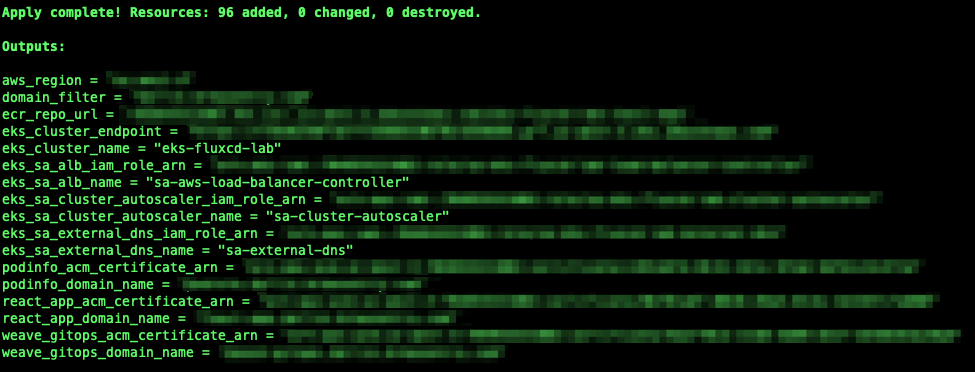

## Configure access to Amazon EKS Cluster

Amazon EKS Cluster details can be extracted from terraform output or by accessing the AWS Console to get the name of the cluster. This following command can be used to update the kubeconfig in your local machine where you run kubectl commands to interact with your EKS Cluster. Navigate to the root of the directory of the GitHub repo and run the following commands:

```bash
cd terraform

AWS_REGION=$(terraform output -raw aws_region)
EKS_CLUSTER_NAME=$(terraform output -raw eks_cluster_name)
aws eks --region $AWS_REGION update-kubeconfig --name $EKS_CLUSTER_NAME
```

Results of configuring kubeconfig.

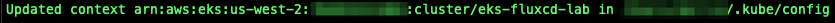

## Create and Push Docker Image to Amazon ECR

## Build the Docker Image

Set the variables needed to build and push your Docker image. Navigate to the root of the directory of the GitHub repo and run the following commands:

```bash
cd terraform

AWS_REGION=$(terraform output -raw aws_region)
ECR_REPO=$(terraform output -raw ecr_repo_url)
```

To build the Docker image, run the following command:

```bash
cd ..
docker build --platform linux/amd64 --no-cache --pull -t ${ECR_REPO}:latest ./react-app
```

## Push the Docker Image to Amazon ECR

To push the Docker image to Amazon ECR, authenticate to your private Amazon ECR registry. To do this, run the following command:

```bash
aws ecr get-login-password --region $AWS_REGION | docker login --username AWS --password-stdin $ECR_REPO
```

Once authenticated, run the following command to push your Docker image to the Amazon ECR repository:

```bash
docker push ${ECR_REPO}:latest
```

## Install Flux CLI and Weave GitOps CLI

1. Install Flux CLI on macOS, and follow these instructions using [Homebrew](https://brew.sh/). Install instructions for other methods can be found [here](https://fluxcd.io/flux/installation/#install-the-flux-cli).

   ```bash
   brew install fluxcd/tap/flux
   ```

2. Install Weave GitOps CLI on macOS, and follow these instructions using [Homebrew](https://brew.sh/). Install instructions for other methods can be found [here](https://docs.gitops.weave.works/docs/open-source/getting-started/install-OSS/).

   ```bash
   brew tap weaveworks/tap
   brew install weaveworks/tap/gitops
   ```

## Configure and Install Flux

Before configuring and installing Flux, we will review the "configure.sh" script and see what it does.

This first section of the "configure.sh" script gathers the AWS resources and names necessary to run the Kubernetes Applications and Services deployed by Flux.

```bash
echo "Gathering AWS resources and names necessary to run the Kubernetes Applications and Services deployed by Flux"

cd ../terraform
AWS_REGION=$(terraform output -raw aws_region)
EKS_CLUSTER_NAME=$(terraform output -raw eks_cluster_name)
EXTERNAL_DNS_DOMAIN_FILTER=$(terraform output -raw domain_filter)
SA_ALB_NAME=$(terraform output -raw eks_sa_alb_name)
SA_ALB_IAM_ROLE_ARN=$(terraform output -raw eks_sa_alb_iam_role_arn)
SA_EXTERNAL_DNS_NAME=$(terraform output -raw eks_sa_external_dns_name)
SA_EXTERNAL_DNS_IAM_ROLE_ARN=$(terraform output -raw eks_sa_external_dns_iam_role_arn)
SA_CLUSTER_AUTOSCALER_NAME=$(terraform output -raw eks_sa_cluster_autoscaler_name)
SA_CLUSTER_AUTOSCALER_IAM_ROLE_ARN=$(terraform output -raw eks_sa_cluster_autoscaler_iam_role_arn)
AWS_WEAVE_GITOPS_DOMAIN_NAME=$(terraform output -raw weave_gitops_domain_name)
AWS_ACM_WEAVE_GITOPS_ARN=$(terraform output -raw weave_gitops_acm_certificate_arn)
AWS_PODINFO_DOMAIN_NAME=$(terraform output -raw podinfo_domain_name)
AWS_ACM_PODINFO_ARN=$(terraform output -raw podinfo_acm_certificate_arn)
AWS_REACT_APP_DOMAIN_NAME=$(terraform output -raw react_app_domain_name)
AWS_ACM_REACT_APP_ARN=$(terraform output -raw react_app_acm_certificate_arn)
REACT_APP_GITHUB_URL="https://github.com/junglekid/aws-eks-fluxcd-lab"
ECR_REPO=$(terraform output -raw ecr_repo_url)
```

The second section of the "configure.sh" script searches and replaces the variables with the actual values necessary to run the Kubernetes Applications and Services deployed by Flux.

This code block is just a snippet of code in this section. Please see the git repo for the complete code.

```bash
echo "Configuring Apps managed by FluxCD..."

cd ..
cp -f ./k8s/templates/apps/base/podinfo.yaml ./k8s/apps/base/podinfo.yaml
replace_in_file 's|AWS_PODINFO_DOMAIN_NAME|'"$AWS_PODINFO_DOMAIN_NAME"'|g' ./k8s/apps/base/podinfo.yaml
replace_in_file 's|AWS_ACM_PODINFO_ARN|'"$AWS_ACM_PODINFO_ARN"'|g' ./k8s/apps/base/podinfo.yaml

cp -f ./k8s/templates/apps/base/weave-gitops.yaml ./k8s/apps/base/weave-gitops.yaml
replace_in_file 's|AWS_WEAVE_GITOPS_DOMAIN_NAME|'"$AWS_WEAVE_GITOPS_DOMAIN_NAME"'|g' ./k8s/apps/base/weave-gitops.yaml
replace_in_file 's|AWS_ACM_WEAVE_GITOPS_ARN|'"$AWS_ACM_WEAVE_GITOPS_ARN"'|g' ./k8s/apps/base/weave-gitops.yaml
...
```

The third and final section of the "configure.sh" script will push the changes to the Git repository.

```bash
echo "Pushing changes to Git repository..."

git add ./k8s/apps/base/podinfo.yaml
git add ./k8s/apps/base/weave-gitops.yaml
git add ./k8s/apps/base/react-app.yaml
git add ./k8s/apps/sources/react-app.yaml
git add ./k8s/infrastructure/addons/aws-load-balancer-controller.yaml
git add ./k8s/infrastructure/addons/external-dns.yaml
git add ./k8s/infrastructure/addons/cluster-autoscaler.yaml
git commit -m "Updating Apps"
git push
```

Now that we have reviewed the "configure.sh" script follow these steps to configure and install Flux.

1. Configure Variables needed to install Flux

   ```bash
   export GITHUB_TOKEN='<REPLACE_WITH_GITHHUB_TOKEN>'
   export GITHUB_USER='<REPLACE_WITH_GITHUB_USER>'
   export GITHUB_OWNER='<REPLACE_WITH_GITHUB_OWNER>'
   export GITHUB_REPO_NAME='<REPLACE_WITH_GITHUB_REPO_NAME>'
   ```

2. Configure Flux Repository by running the "configure.sh" script. The "configure.sh" script updates the various applications with the necessary values to run correctly. Navigate to the root of the directory of the GitHub repo and run the following commands:

   ```bash
   cd scripts

   ./configure.sh
   cd ..
   ```

3. Results of running the "configure.sh" script.

   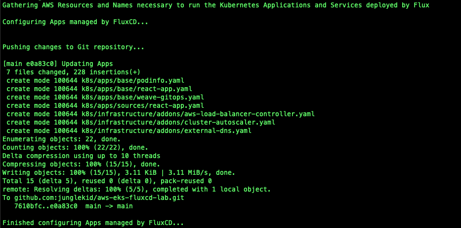

4. Install Flux on the Amazon EKS Cluster

   ```bash
   flux bootstrap github \
     --components-extra=image-reflector-controller,image-automation-controller \
     --owner=$GITHUB_OWNER \
     --repository=$GITHUB_REPO_NAME \
     --private=false \
     --path=clusters/eks-fluxcd-lab \
     --personal
   ```

5. Results of installing Flux on the Amazon EKS Cluster.

   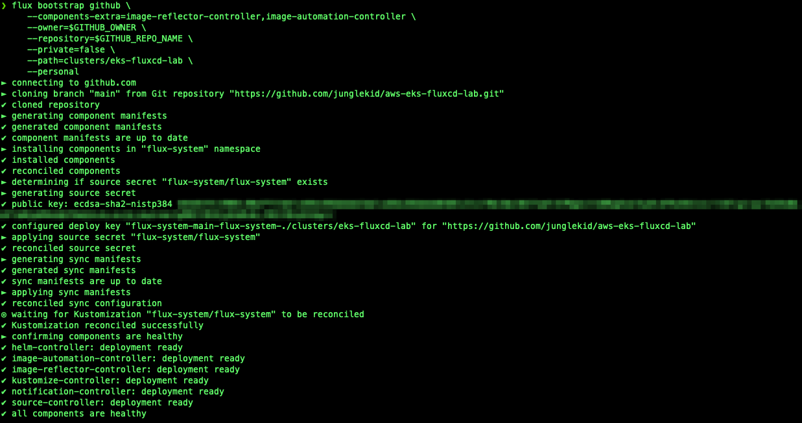

## Folder Structure of Flux Git Repository

Flux provides several ways to structure and organize your repositories. Please click [here](https://fluxcd.io/flux/guides/repository-structure/) if you want more information on the various methods

Let's see how we organized the folder structure. It looks like this.

Each cluster we want to manage is defined in a dedicated directory. In this example, we are using the name "eks-fluxcd-lab". This directory is where we define the apps and infrastructure we want to be managed by Flux.

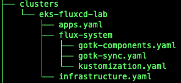

As you can see, this allows us to have multiple cluster configurations for Flux to manage. We can keep all of the code in on Git repository.

Below is the folder structure we are using to define what apps and infrastructure we want to be managed by Flux.

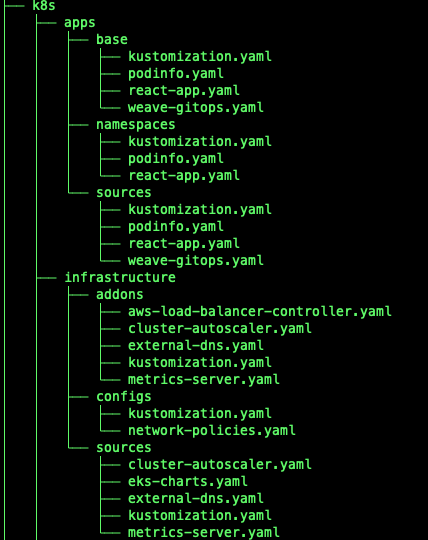

One benefit of separating apps from infrastructure is that we can define the order in apps, and infrastructure is reconciled and deployed. In this example, infrastructure is deployed first, then the apps are deployed. This is accomplished by the apps.yaml and infrastructure.yaml files are located in the clusters/eks-flux-lab folder.

In the apps.yaml, the "app-sources" depend on "infra-configs" to be reconciled first.

```yaml
apiVersion: kustomize.toolkit.fluxcd.io/v1
kind: Kustomization
metadata:
  name: apps-sources
  namespace: flux-system
spec:
  dependsOn:
    - name: infra-configs
  interval: 10m0s
  retryInterval: 1m0s
  timeout: 5m0s
  sourceRef:
    kind: GitRepository
    name: flux-system
  path: ./k8s/apps/sources
  prune: true
  wait: true
```

## Managing Flux

Managing Flux is handled by using the Flux CLI. Flux does not come with any Web or UI interface to manage Flux. Please click [here](https://fluxcd.io/flux/cmd/) if you would like more information on the Flux CLI.

The following are some commands you can use to manage Flux.

```bash
flux get all
flux get sources all|git|helm|chart
flux get helmreleases
flux get kustomizations
flux logs
flux suspend kustomization <kustomization_name>
flux reconcile source git flux-system
```

In the section [Configure and Install Flux](#configure-and-install-flux), we configured and installed Flux. Once Flux was up and running, Flux began to reconcile the Git repository we specified, which installed and configured all of the defined Kubernetes Addons and Applications.

## Weave GitOps - A Flux Web User Interface

Weave GitOps is a Web User Interface for Flux. Weave provides two versions, an open-source and an enterprise version. Flux will install the open-source version of Weave GitOps as part of the Apps section of the configuration in the Git repository. For more information about Weave GitOps, click [here](https://docs.gitops.weave.works/docs/intro-weave-gitops/)

## Kubernetes Addons managed by Flux

Before the Applications that Flux manages, the Kubernetes Addons will be deployed and configured by Flux first. The following Kubernetes Addons will be installed.

* AWS Application Load Balancer Controller
* External DNS
* Cluster Autoscaler
* Metrics Server

The AWS Application Load Balancer Controller and External DNS must be deployed first because the Applications need to be accessible by a load balancer and have the DNS Name registered with Route 53.

## Applications managed by Flux

Flux can manage applications in several ways, but the most common way is through the Helm Controller. Flux will manage three Applications using Helm charts to deploy to the Amazon EKS Cluster. The three Applications are the following.

* [Podinfo](https://github.com/stefanprodan/podinfo) - A tiny web application made with Go
* React App - Docker image we built and uploaded to Amazon ECR
* [Weave GitOps](https://docs.gitops.weave.works/docs/intro-weave-gitops/) - Flux Web UI

## Access Applications managed by Flux

Let's access the Applications managed by Flux. Retrieve the domain names specified in the "locals.tf" when you ran Terraform earlier.

For the Podinfo App, you can access the Podinfo URL in your favorite web browser.
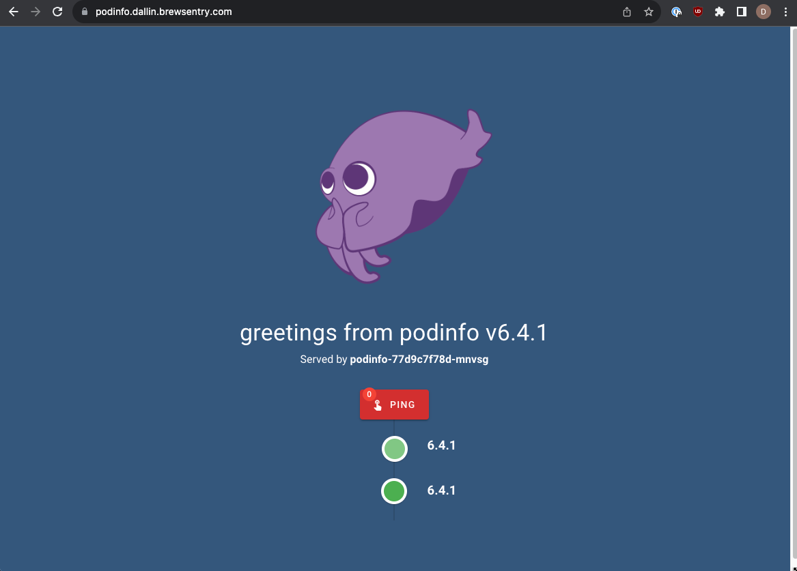

For the React App, you can access the React App URL in your favorite web browser.
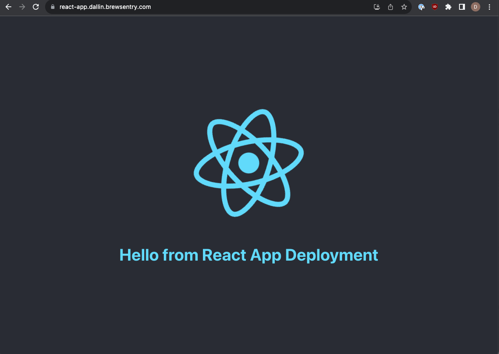

For the Weave GitOps App, you can access the Weave GitOps URL in your favorite web browser.
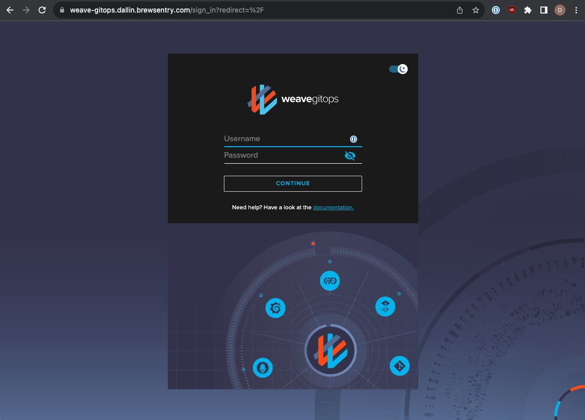

The default user name and password for Weave GitOps are the following

* Username: admin
* Password: Flux&Git0ps

## Demonstrate how Flux works

To demonstrate how Flux works, we will be using the Flux CLI.

## Check the Status of Flux

Let's check the status of all resources managed by Flux by running the following command.

```bash
flux get all
```

Result of running the above command.
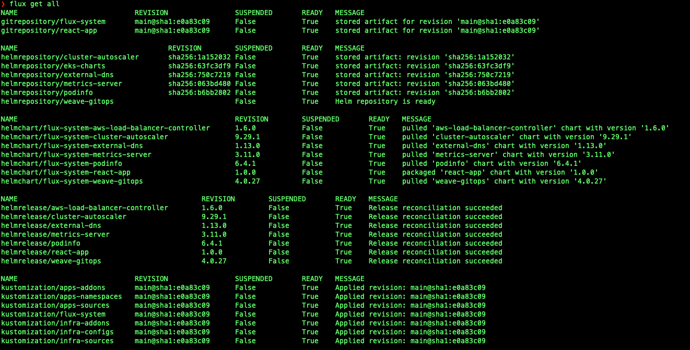

## Reconcile Helm Release with Flux

Let's see how Flux reconciles the sources and resources if the helm release "podinfo" is manually deleted.

1. Check Flux status of Podinfo by running the following commands

   ```bash
   flux get helmrelease podinfo
   flux get source helm podinfo
   flux get source chart flux-system-podinfo
   ```

2. Result of checking Flux status of Podinfo

   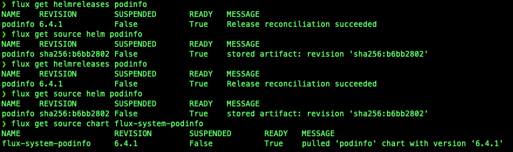

3. Delete the Podinfo helm release

   ```bash
   flux delete helmrelease podinfo
   ```

4. Result of deleting Podinfo helm release

   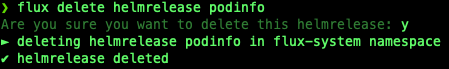

5. Check Flux that Podinfo helm release is no longer listed

   ```bash
   flux get helmrelease podinfo
   ```

6. Result of checking Flux that Podinfo helm release is no longer listed

   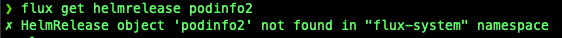

7. Check Kubernetes if Podinfo is no longer deployed

   ```bash
   kubectl get all -n podinfo
   ```

8. Result of checking Kubernetes if Podinfo is no longer deployed

   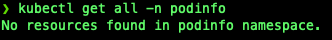

9. Wait for Flux to reconcile the Podinfo helm release.

   ```bash
   flux get helmrelease podinfo
   ```

10. Status of Flux reconciling the Podinfo helm release.

    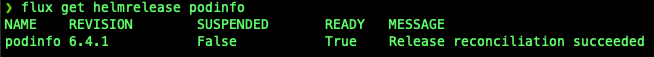

11. Check Kubernetes if Podinfo is deployed after Flux reconciling.

    ```bash
    kubectl get all -n podinfo
    ```

12. Result of checking Kubernetes if Podinfo is deployed after Flux reconciling.

    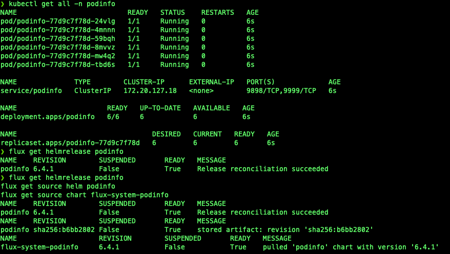

As you can see, Flux can reconcile resources and sources that are changed. You can also manually trigger a Flux reconciliation with the following commands.

```bash
flux reconcile helmrelease podinfo
flux reconcile source git flux-system
flux reconcile kustomization apps-addons
```

## Clean Up

## Clean up Applications managed by Flux from Kubernetes

1. Suspend Applications managed by Flux

   ```bash
   flux suspend source git react-app
   flux suspend kustomization apps-addons apps-namespaces apps-sources
   ```

2. Delete Applications managed by Flux

   ```bash
   flux delete helmrelease -s podinfo
   flux delete helmrelease -s weave-gitops
   flux delete helmrelease -s react-app
   ```

3. Wait 1 to 5 minutes for Applications to be removed from Kubernetes

4. Delete Application sources managed by Flux

   ```bash
   flux delete source helm -s weave-gitops
   flux delete source helm -s podinfo
   flux delete source git -s react-app
   flux delete kustomization -s apps-addons
   flux delete kustomization -s apps-namespaces
   flux delete kustomization -s apps-sources
   ```

5. Verify Applications are removed

   ```bash
   kubectl -n react-app get all -l app.kubernetes.io/name=react-app
   kubectl -n podinfo get all -l app.kubernetes.io/name=podinfo
   kubectl -n flux-system get all -l app.kubernetes.io/name=weave-gitops
   kubectl -n react-app get ingresses -l app.kubernetes.io/name=react-app
   kubectl -n podinfo get ingresses -l app.kubernetes.io/name=podinfo
   kubectl -n flux-system get ingresses -l app.kubernetes.io/name=weave-gitops
   ```

## Clean up Kubernetes Addons managed by Flux from Kubernetes

1. Suspend and Delete Kubernetes Addons managed by Flux

   ```bash
   flux suspend kustomization infra-addons infra-configs infra-sources
   flux delete helmrelease -s metrics-server
   flux delete helmrelease -s external-dns
   flux delete helmrelease -s aws-load-balancer-controller
   flux delete helmrelease -s cluster-autoscaler
   flux delete source helm -s metrics-server
   flux delete source helm -s external-dns
   flux delete source helm -s eks-charts
   flux delete source helm -s cluster-autoscaler
   ```

2. Verify Kubernetes Addons were removed successfully

   ```bash
   kubectl -n kube-system get all -l app.kubernetes.io/name=external-dns
   kubectl -n kube-system get all -l app.kubernetes.io/name=aws-load-balancer-controller
   kubectl -n kube-system get all -l app.kubernetes.io/name=aws-cluster-autoscaler
   kubectl get ingressclasses -l app.kubernetes.io/name=aws-load-balancer-controller
   ```

## Uninstall Flux from Kubernetes

1. Uninstall Flux

   ```bash
   flux uninstall -s
   ```

2. Verify Flux was removed successfully

   ```bash
   kubectl get all -n flux-system
   ```

## Clean up Terraform

1. Navigate to the root of the directory of the GitHub repo and run the following commands

   ```bash
   cd terraform

   terraform destroy
   ```

2. Check Terraform destroy results

   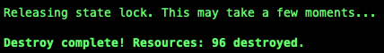

## Conclusion

In conclusion, this guide provided a comprehensive overview of utilizing Amazon EKS and Flux to implement the GitOps methodology for deploying and managing applications and infrastructure. GitOps, a DevOps approach, leverages version control and collaboration principles from Git to streamline application deployment and infrastructure management. Flux, an open-source tool, automates application deployments, infrastructure deployments, and lifecycle management in Kubernetes clusters.
